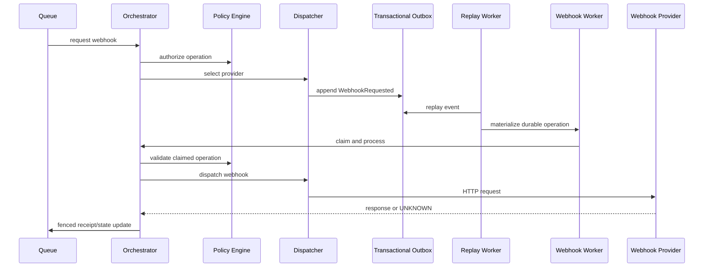

# Webhook Delivery Sequence

```mermaid
sequenceDiagram
    participant Q as Queue
    participant O as Orchestrator
    participant P as Policy Engine
    participant D as Dispatcher
    participant X as Transactional Outbox
    participant R as Replay Worker
    participant W as Webhook Worker
    participant H as Webhook Provider
    Q->>O: request webhook
    O->>P: authorize operation
    O->>D: select provider
    D->>X: append WebhookRequested
    R->>X: replay event
    R->>W: materialize durable operation
    W->>O: claim and process
    O->>P: validate claimed operation
    O->>D: dispatch webhook
    D->>H: HTTP request
    H-->>O: response or UNKNOWN
    O->>Q: fenced receipt/state update
```

An expired lease is fenced. UNKNOWN is persisted for reconciliation and is not automatically claimed for delivery again.
